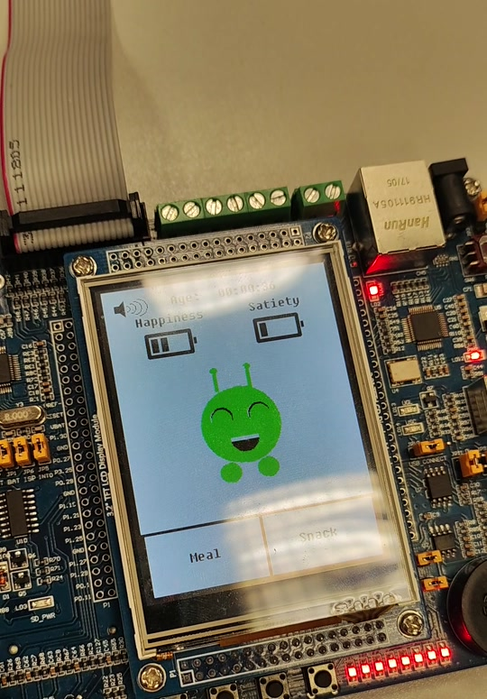
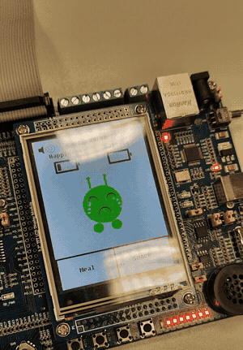

# ARM Tamagotchi — Embedded Virtual Pet on LPC1768

Individual project developed for the **Computer Architecture** course (Politecnico di Torino). Implements a virtual "Tamagotchi" — an interactive digital pet — on an ARM Cortex-M3 microcontroller, developed and tested on a **physical LANDTIGER board** (LPC1768).



## Features

- A virtual pet ("Mooncake") lives on the GLCD screen and reacts to user input
- **Feeding**: Meal/Snack menu that affects the character's satiety and happiness levels, selected by joystick
- **Touchscreen cuddles**: touching the character on the touch panel triggers a dedicated animation that increases happiness
- **Sound effects** on every major animation (menu clicks, eating, cuddles, character death/run away)
- **Volume control** via a potentiometer, sampled through the ADC every 50 ms
- The character ages over time, driven by hardware timers
- The pet itself stays still on screen; movement only happens as part of its animations (eating, cuddling, running away)

## Architecture and concepts implemented

This project was an opportunity to apply core embedded systems concepts in practice:

- **Interrupt handling**: dedicated interrupt handlers for timers, the RIT (Repetitive Interrupt Timer), external buttons (EXINT), and the ADC
- **Multiple concurrent timers** orchestrating: the base animation, character aging every second, and finer-grained periodic events (50 ms)
- **Communication with external peripherals**: GLCD display over a parallel bus, resistive touch panel, analog joystick, ADC for the volume potentiometer
- **Low-level, register-based peripheral programming** (direct access to LPC17xx microcontroller registers, without high-level libraries)
- **Synchronization constraints**: for example, the RIT (which detects touchscreen presses) is disabled during other animations to avoid overlaps, and re-enabled once they complete

The [`docs/Application Note.pdf`](docs/Application%20Note.pdf) document describes the implementation details of the cuddle animation (the RIT/Timer0 interrupt handling involved).

## Repository structure

```
├── src/
│   ├── sample.c              # Entry point, peripheral and timer initialization
│   ├── functions.c/.h        # Game logic: menus, animations, character state
│   ├── core_cm3.c            # ARM Cortex-M3 core (CMSIS)
│   ├── system_LPC17xx.c      # System initialization (clock, PLL)
│   ├── startup_LPC17xx.s     # Microcontroller startup assembly
│   ├── adc/                  # ADC reading (volume potentiometer)
│   ├── button_EXINT/         # External interrupt handling for buttons
│   ├── joystick/              # Joystick input (menu selection)
│   ├── led/                   # LED handling
│   ├── RIT/                    # Repetitive Interrupt Timer (touch detection)
│   ├── timer/                  # Hardware timers (animations, aging)
│   ├── TouchPanel/             # Resistive touch panel driver
│   └── GLCD/                   # Graphic display driver and font library
├── keil_project/
│   ├── sample.uvprojx         # Keil µVision project
│   └── sample.sct              # Scatter file (linker memory layout)
└── docs/
    ├── ExtraPoint2.pdf         # Assignment specification
    ├── Application Note.pdf    # Technical note on the cuddle animation
    ├── screenshot_ui.jpg        # Photo of the pet running on the board
    └── mooncake_neglect.gif     # Demo of the "neglect" ending animation
```

## Building and running

Requires [Keil µVision (MDK-ARM)](https://www.keil.com/) with Cortex-M3 support.

1. Open `keil_project/sample.uvprojx` in Keil µVision
2. Connect a LANDTIGER board (LPC1768) via a J-Link debugger, or configure the built-in simulator
3. Build and flash (Download) to the board
4. On power-up, the character appears on the GLCD display and is ready for interaction

## Tech stack

`C` · `ARM Cortex-M3 (LPC1768)` · `Keil µVision / MDK-ARM` · `CMSIS` · Bare-metal, register-level programming

## Fun fact

The pet's name, "Mooncake", is a nod to the character from the animated series *Final Space*: an adorable-looking creature that is secretly capable of immense destruction. If you neglect Mooncake for too long, it fades away with a message that plays on that same reference:



## Notes

This project was developed as part of a university course, for educational purposes. The base Keil project template (folder structure, GLCD/TouchPanel library drivers) was provided as course material; the Tamagotchi game logic, animation handling, touchscreen/audio/volume integration, and the related technical documentation are original work.
